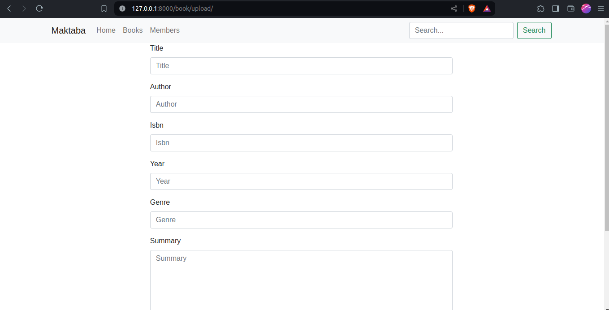
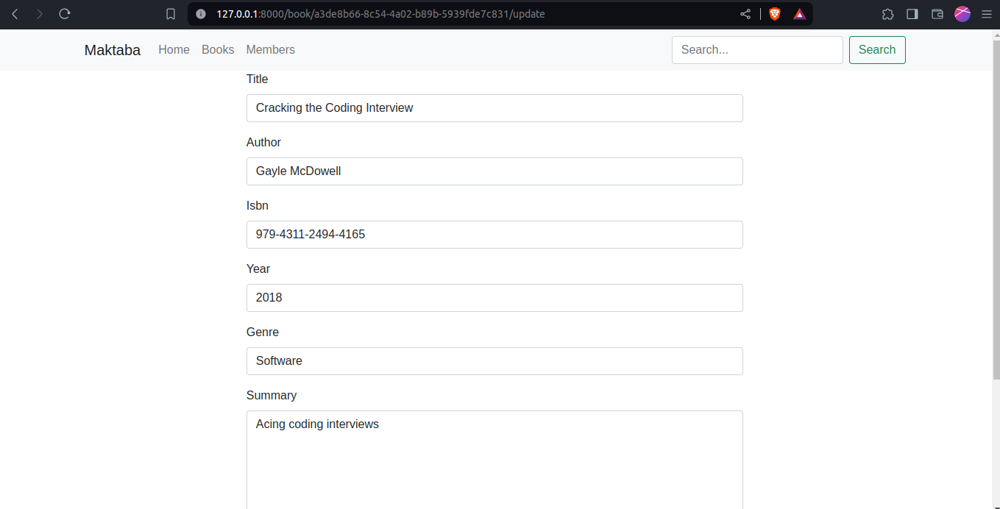
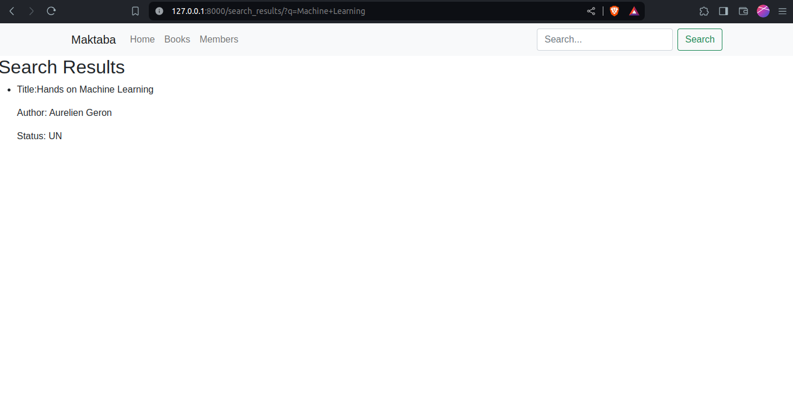
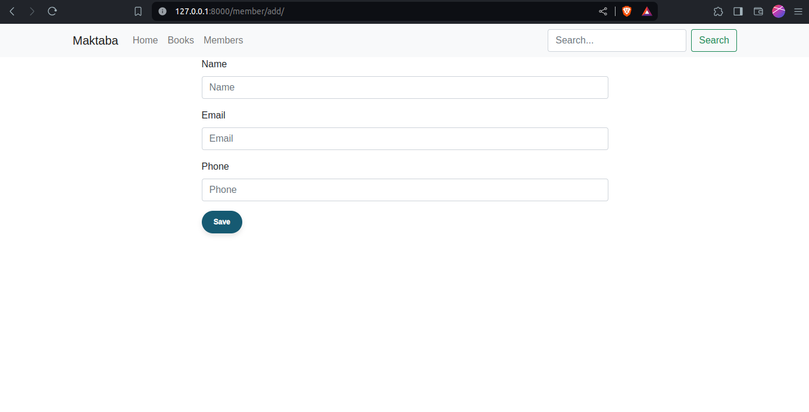
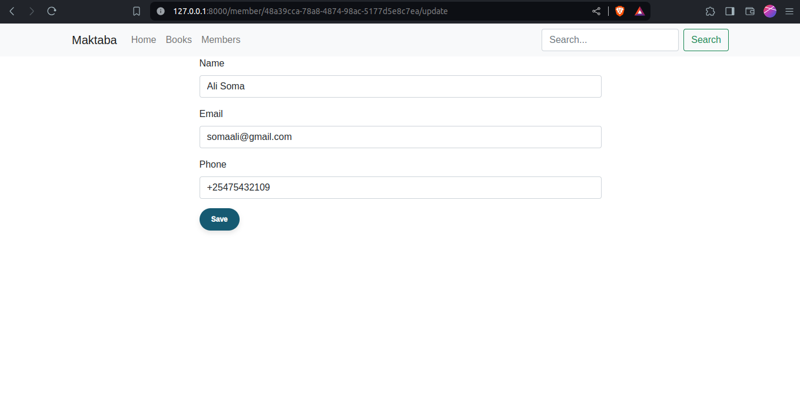
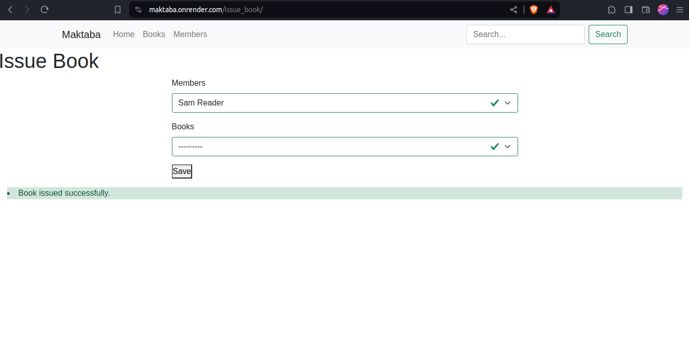
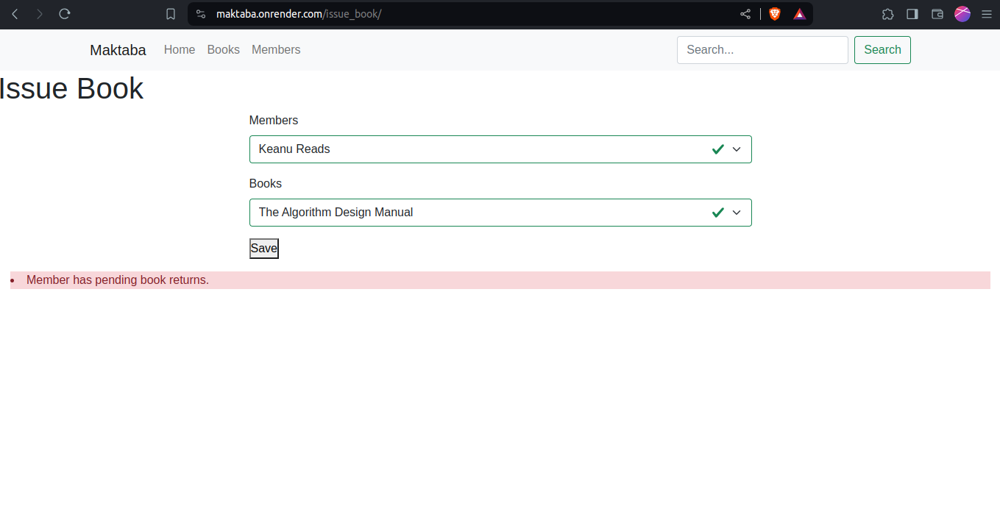

# Library Management Web Application
-------------------------------------------
## Overview

This is a simple web application designed to manage the operations of a local library. The application allows librarians to track books, members, and transactions efficiently. It includes functionalities such as CRUD operations for books and members, issuing books to members, searching for books, and managing book fees.  

Live Link  
https://maktaba.onrender.com/  


## Functionality Checklist

- [x] Perform general CRUD operations on Books and Members
- [x] Issue a book to a member
- [x] Issue a book return from a member
- [x] Search for a book by name and author
- [x] Charge a rent fee on book returns
- [x] Ensure a member’s outstanding debt is not more than KES.500

## Features  

## Models  
> Member  
- This is the Member model, creates library member using their name, email and
  phone with the member_id being generated automatically using uuid
```
 class Member(models.Model):
      member_id = models.UUIDField(primary_key=True, default=uuid.uuid4)
      name = models.CharField(max_length=200)
      email = models.EmailField()
      phone = models.CharField(max_length=80)

      def __str__(self):
              return f'{self.name}'

      class Meta:
      	ordering = ['name']

     def get_absolute_url(self):
           return reverse(
           'soma:member_detail',
           args=[str(self.member_id)]
           )
```  

> Book  
- The book model with multiple fields, the status field is set as available by
  default to signify the book is available for borrowing  
- The borrower is a foreign key of the Member model to show which member
  borrowed which book establishing a relationship between book and member  

```
class Book(models.Model):
    class BookStatus(models.TextChoices):
        AVAILABLE = "AV", _("Available")
        UNAVAILABLE = "UN", _("Unavailable")

    book_id = models.UUIDField(primary_key=True, default=uuid.uuid4)
    title = models.CharField(max_length=200)
    author = models.CharField(max_length=200)
    isbn = models.CharField(max_length=200)
    year = models.IntegerField()
    genre = models.CharField(max_length=80)
    summary = models.TextField()
    date_added = models.DateTimeField(auto_now_add=True)
    date_updated = models.DateTimeField(auto_now=True)
    status = models.CharField(
            max_length=2,
            choices=BookStatus.choices,
            default=BookStatus.AVAILABLE,
            )
    cost = models.DecimalField(max_digits=5, decimal_places=2)
    borrower = models.ForeignKey(
            Member,
            on_delete=models.SET_NULL,
            null=True,
            blank=True
            )

    def __str__(self):
        return f'{self.title}'

    class Meta:
        ordering = ['title']

    def get_absolute_url(self):
        return reverse('soma:book_detail', args=[str(self.book_id)])
```  

> BookTransaction  
- This model helps keep track of books issued and books returned  
- It based on the days a book was returned calculates how much the member owes
  the library
- It uses the Book and Member as foreign keys  

```  
class BookTransaction(models.Model):
    member = models.ForeignKey(
            Member,
            on_delete=models.CASCADE,
            related_name='member_transaction'
            )
    book = models.ForeignKey(
            Book,
            on_delete=models.CASCADE,
            related_name='book_transaction'
            )
    date_borrowed = models.DateTimeField(auto_now_add=True)
    date_returned = models.DateTimeField(auto_now_add=True, null=True)
    returned = models.BooleanField(default=False)
    total_cost = models.DecimalField(
            max_digits=5,
            decimal_places=2,
            blank=True,
            null=True
            )
    borrowed_days = models.IntegerField(blank=True, null=True)

    def save(self, *args, **kwargs):
        self.borrowed_days = self.calc_borrowed_days()
        self.total_cost = self.calc_total_cost(self.borrowed_days)

        self.member.cost_incurred = self.total_cost

        super(BookTransaction, self).save(*args, **kwargs)

    def calc_borrowed_days(self):
        if self.date_borrowed is not None:
            if self.date_returned:
                return (self.date_returned - self.date_borrowed).days
            else:
                return (timezone.now() - self.date_borrowed).days
        else:
            return None

    def calc_total_cost(self, borrowed_days):
        cost_per_day = self.book.cost
        return cost_per_day * borrowed_days

    def __str__(self):
        return f'{self.member.name} borrowed {self.book.title}'

    class Meta:
        ordering = ['date_borrowed']

    def get_absolute_url(self):
        return reverse('soma:transaction_detail', args=[str(self.id)])
```  


### Books Management

- **Add Book**: Allows librarians to add new books to the library inventory. Librarians can input book details such as title, author, genre, and quantity.  

---------------------------------------  

  

-------------------------------------

- **Update Book**: Enables librarians to update the details of existing books, including title, author, genre, and quantity.  
---------------------------------------------------------------  

  

------------------------------------------------------------  

- **Delete Book**: Allows librarians to remove books from the library inventory.  

- **Search Book**: Provides a search functionality for librarians to find books by title or author.  

------------------------------------  

  

```
class SearchResultsView(TemplateView):
    """display search results"""
    template_name = 'soma/search.html'

    def get_context_data(self, **kwargs):
        context = super().get_context_data(**kwargs)
        q = self.request.GET.get('q')
        if q:
            context['results'] = Book.objects.filter(
                    Q(title__icontains=q) | Q(author__icontains=q)
                    )

        return context
```

- Search query user provides is compared to existing data on Book title and
  author, if none is found 'No search results found' is raised  

--------------------------------------  


### Members Management

- **Add Member**: Allows librarians to add new members to the library system. Librarians can input member details such as name, contact information, and membership ID.  
-----------------------------------------------------------  
  

----------------------------------------  

- **Update Member**: Enables librarians to update the details of existing members, including name, contact information, and membership ID.  
-----------------------  
  
------------------------------  

- **Delete Member**: Allows librarians to remove members from the library system.

### Transaction Management

- **Issue Book**: Allows librarians to issue a book to a member. This involves reducing the stock of the book in the inventory and recording the transaction details.  
---------------------------  

```
class IssueBookView(View):
    model = BookTransaction
    form_class = IssueBookForm
    template_name = 'soma/issue_book.html'
    success_url = reverse_lazy('soma:home')

    def get(self, request, *args, **kwargs):
        form = self.form_class()
        return render(request, self.template_name, {'form': form})

    def post(self, request, *args, **kwargs):
        """saves form data to db"""
        form = self.form_class(request.POST)
        if form.is_valid():
            member = form.cleaned_data['member']
            book = form.cleaned_data['book']

            # check if member has any pending book returns
            pending_returns = BookTransaction.objects.filter(
                member=member,
                date_returned=None
            ).exists()

            print(pending_returns)

            if pending_returns:
                messages.error(request, 'Member has pending book returns.')
                return render(request, self.template_name, {'form': form})

            if book.status == Book.BookStatus.AVAILABLE:
                book.status = Book.BookStatus.UNAVAILABLE
                book.borrower = member
                book.save()

                date_borrowed = timezone.now()

                BookTransaction.objects.create(
                            member=member,
                            book=book,
                            # status=book.status,
                            date_borrowed=date_borrowed,
                            )

                messages.success(self.request, 'Book issued successfully.')
                return render(self.request, self.template_name, {'form': form})
            else:
                messages.error(self.request, 'Book is already borrowed.')
                return render(self.request, self.template_name, {'form': form})

        else:
            messages.error(
                    self.request,
                    'There was an error processing your request'
                    )
        return render(self.request, self.template_name, {'form': form})
```  

> Successfully issuing a book  

  

> No book is issued if member has a pending book return  


  

-----------------------------  

- **Return Book**: Debugging  
----------------------------------  

```
class ReturnBookView(View):
    """return a book"""
    model = BookTransaction
    form_class = ReturnBookForm
    template_name = 'soma/return_book.html'
    success_url = reverse_lazy('soma:home')

    def get(self, request, *args, **kwargs):
        form = self.form_class()
        return render(request, self.template_name, {'form': form})

    @transaction.atomic
    def post(self, request):
        form = self.form_class(request.POST)

        if form.is_valid():
            member = form.cleaned_data['member']
            book = form.cleaned_data['book']
            transaction = get_object_or_404(
                    BookTransaction,
                    member=member,
                    book=book
                    )
            transaction.date_returned = timezone.now()
            transaction.returned = True
            transaction.borrowed_days = transaction.calc_borrowed_days()

            if transaction.borrowed_days is None:
                messages.error(request, "No data found for date borrowed")
                return render(request, self.template_name, {'form': form})

            transaction.total_cost = transaction.calc_total_cost(transaction.borrowed_days)

            book.status = Book.BookStatus.AVAILABLE
            book.borrower = None
            book.save()

            member.cost_incurred = transaction.total_cost
            member.save()

            transaction.delete()

            if member.cost_incurred > 500:
                sentence = f"{member.name} owes a total of \
                       Kes.{member.cost_incurred} which exceeds\
                       max limit of Kes.500"
            else:
                sentence = f"{member.name} owes a total of \
                        Kes.{member.cost_incurred}"

            return render(
                    request,
                    self.template_name,
                    {'form': form, 'sentence': sentence}
                    )
        else:
            messages.error(
                    self.request,
                    'There was an error processing your request'
                    )
            return render(request, self.template_name, {'form': form, 'errors': form.errors})

        return render(request, self.template_name, {'form': form})
```  

> Amount member owed is displayed on return and if it exceeds 500 a warning is
> raised  

  

------------------------------------

## Technologies Used

- **Framework**: Django
- **Database**: SQLite  
- **Frontend**: HTML, CSS
- **Additional Libraries/Frameworks**: Bootstrap5

## Setup Instructions

1. Clone the repository from [GitHub](https://github.com/ru0ya/Maktaba).  

`git clone https://github.com/ru0ya/Maktaba`  

2. Install dependencies using `pip3 install -r requirements.txt`.
3. Run `python3 manage.py migrate` to apply migrations
4. Start development server using `python3 manage.py runserver`
5. Access the application through the provided URL.
