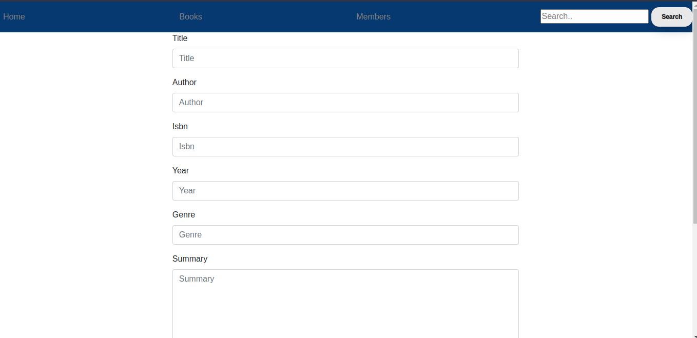
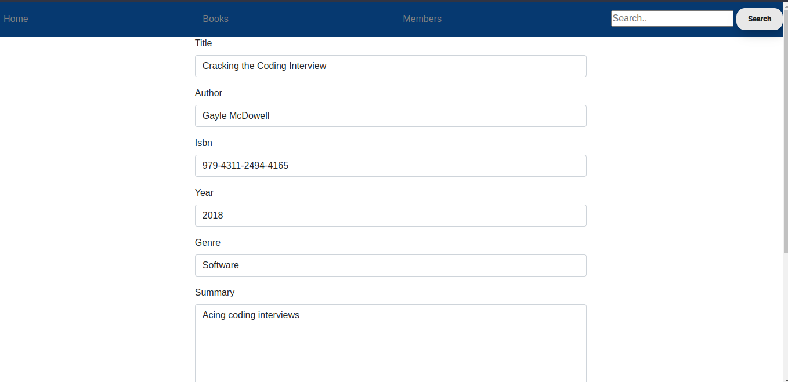
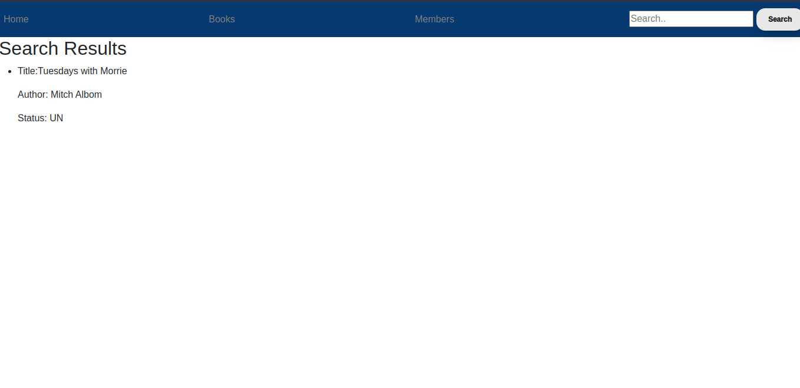
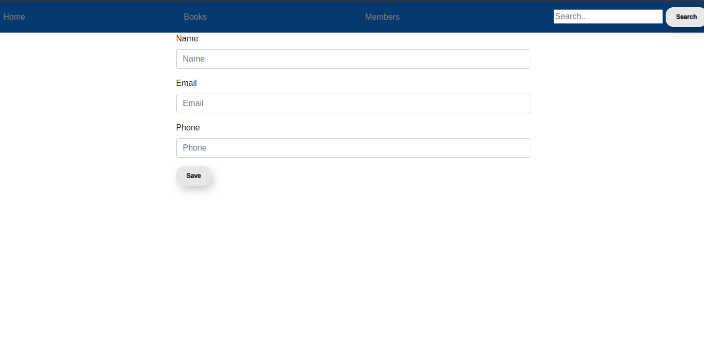
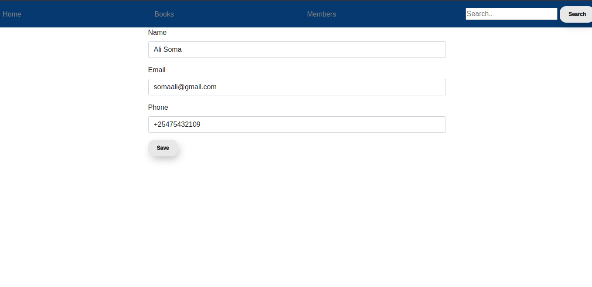
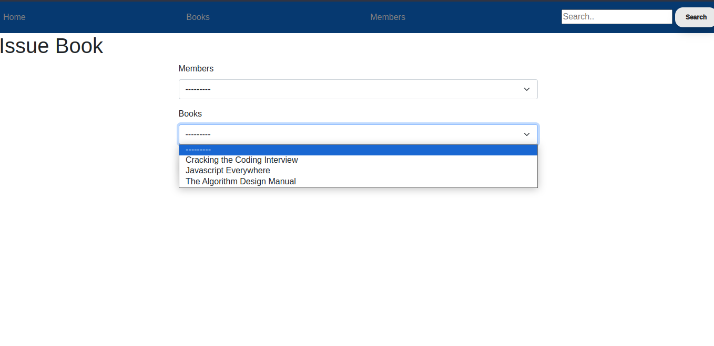
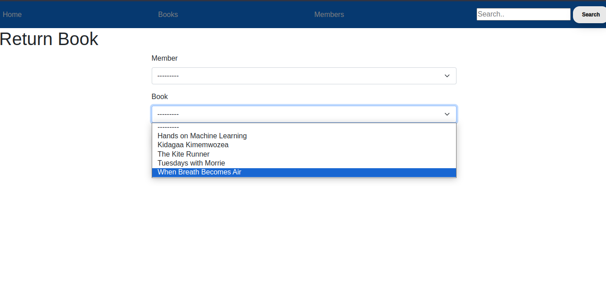

# Library Management Web Application
-------------------------------------------
## Overview

This is a simple web application designed to manage the operations of a local library. The application allows librarians to track books, members, and transactions efficiently. It includes functionalities such as CRUD operations for books and members, issuing books to members, searching for books, and managing book fees.

## Functionality Checklist

- [x] Perform general CRUD operations on Books and Members
- [x] Issue a book to a member
- [ ] Issue a book return from a member
- [x] Search for a book by name and author
- [ ] Charge a rent fee on book returns
- [x] Ensure a member’s outstanding debt is not more than KES.500

## Features

### Books Management

- **Add Book**: Allows librarians to add new books to the library inventory. Librarians can input book details such as title, author, genre, and quantity.  

---------------------------------------  

  

-------------------------------------

- **Update Book**: Enables librarians to update the details of existing books, including title, author, genre, and quantity.  
---------------------------------------------------------------  

  

------------------------------------------------------------  

- **Delete Book**: Allows librarians to remove books from the library inventory.  

- **Search Book**: Provides a search functionality for librarians to find books by title or author.  

------------------------------------  

   

--------------------------------------  

### Members Management

- **Add Member**: Allows librarians to add new members to the library system. Librarians can input member details such as name, contact information, and membership ID.  
-----------------------------------------------------------  
  

----------------------------------------  

- **Update Member**: Enables librarians to update the details of existing members, including name, contact information, and membership ID.  
-----------------------  
  
------------------------------  

- **Delete Member**: Allows librarians to remove members from the library system.

### Transaction Management

- **Issue Book**: Allows librarians to issue a book to a member. This involves reducing the stock of the book in the inventory and recording the transaction details.  
---------------------------  
  

-----------------------------  

- **Return Book**: Debugging  
----------------------------------  
  

------------------------------------
- **Manage Fees**: Work in Progress

## Technologies Used

- **Framework**: Django
- **Database**: SQLite  
- **Frontend**: HTML, CSS
- **Additional Libraries/Frameworks**: Bootstrap (for frontend styling), Mongoose (for MongoDB object modeling)

## Setup Instructions

1. Clone the repository from [GitHub](https://github.com/ru0ya/Maktaba).  

`git clone https://github.com/ru0ya/Maktaba`  

2. Install dependencies using `pip3 install -r requirements.txt`.
3. Run `python3 manage.py migrate` to apply migrations
4. Start development server using `python3 manage.py runserver`
5. Access the application through the provided URL.
